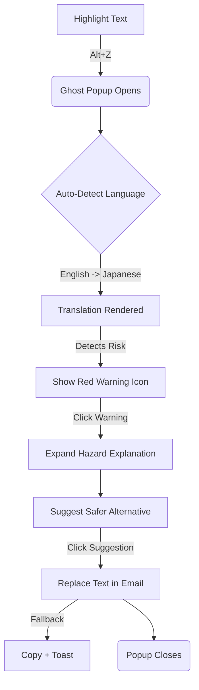
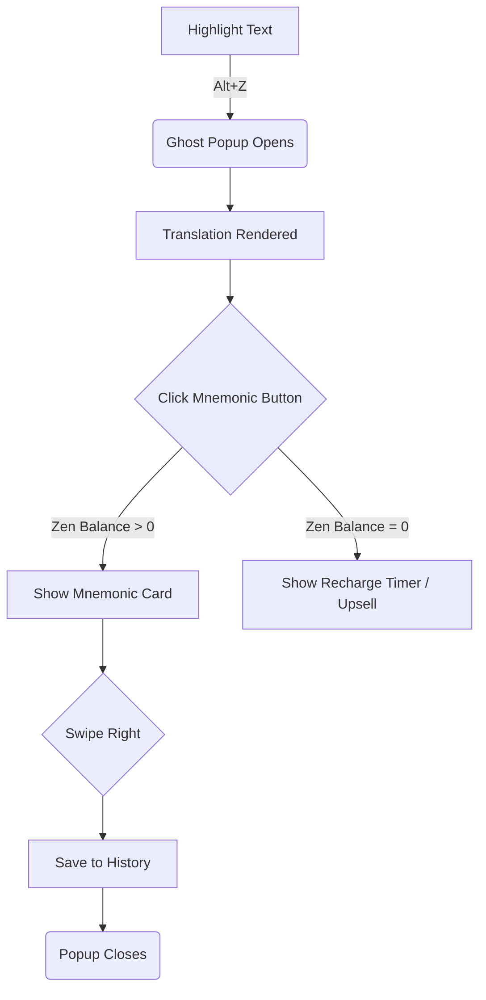

# UX Design Specification - Lingua-Zen

**Author:** Aziuk
**Date:** 2026-02-05

---

## Executive Summary

### Project Vision

Lingua-Zen is a "Ghost" desktop utility—an invisible layer of intelligence that decodes language instantly. The UX philosophy is **"Zen Speed, Addictive Depth"**. It rejects the traditional "Main Window" paradigm for daily use, favoring ephemeral popups invoked by `Alt+Z`.

### Target Users

- **Sarah, The Diplomat:** Values "Peace of Mind" and cultural safety. Needs a discreet, professional UI.
- **Alex, The Grinder:** Values memorization and tracking. Needs engaging, gamified feedback loops.

### Key Design Challenges

- **The "Invisible App" Problem:** Users might forget the app is running or think it's broken if it has no window.
    - *Solution:* **Smart Launch Logic.** First run opens the Tutorial. Subsequent re-launches (if already running) open the Settings window. Startup triggers a "Zen Pulse" in the tray.
- **Friction Monetization:** The "Zen Focus Meter" must be visible enough to drive conversion but subtle enough to not feel like malware.
- **Performance Perception:** Cloud latency must be masked by hypnotic "Breathing" animations.

### Design Opportunities

- **The "Zen Pulse":** A signature micro-interaction in the system tray that builds trust and brand recognition.
- **Quote-Translate Cards:** Turning utility into shareable art.

## Core User Experience

### Defining Experience

The core experience is **"Thought-Speed Comprehension."** The user shouldn't feel like they are using an app; they should feel like their operating system has gained intelligence. The interaction loop is: **Select -> Shortcut -> Insight.**

### Platform Strategy

- **Platform:** Desktop Application (Tauri).
- **Input:** Keyboard-centric (`Alt+Z`) for invocation; Mouse for interaction (hover for deep insights, click for mnemonic).
- **Constraint:** Must work over *any* application (PDF, Browser, IDE, Game).

### Effortless Interactions

- **Zero-Click Input:** The app automatically ingests selected text upon invocation.
- **Smart Toggles:** Language detection and context switching (Translation vs Explanation) happen automatically based on input type.
- **Transient Existence:** The popup dismisses on `Esc` or click-away, leaving no trace.

### Critical Success Moments

- **Instant Context:** The popup appears in <200ms right where the user's eye is focused.
- **The "Zen" Breath:** During API latency, the "Breathing Loader" keeps the user calm instead of frustrated.

### Experience Principles

1.  **Invisible until Needed:** The app has no screen presence until summoned.
2.  **Speed is Feature #1:** Every interaction must feel instant or be beautifully masked.
3.  **Trust via Friction:** Monetization friction (Zen Focus Meter) must be transparent and predictable, never surprising.

## Desired Emotional Response

### Primary Emotional Goals

- **Relief & Safety:** The user feels a weight lift when the "Social Hazard" warning safeguards their communication.
- **Flow & Mastery:** The user feels smarter and faster, assimilated with the language.
- **Subtle Delight:** The "Zen Pulse" transforms latency into a moment of calm.

### Emotional Journey Mapping

- **Trigger (Anxiety):** "I don't understand."
- **Action (Focus):** Double-click. A moment of pause.
- **Result (Clarity):** Anxiety replaced by confidence.
- **Growth (Pride):** Saving a card feels like collecting knowledge.

### Micro-Emotions

- **Trust:** Zero-Log transparency builds confidence.
- **Curiosity:** "Rare Drop" cards trigger intellectual dopamine.

### Design Implications

- **Adaptive Tone:** The UI shifts personality. "Social Hazard" warnings are sober and respectful. "Mnemonics" are playful and bouncy.
- **Calm Aesthetics:** Whitespace, soft shadows, rounded corners.
- **Predictable Motion:** 60fps eased animations.

### Emotional Design Principles

1.  **Don't Startle:** No sudden sounds or flashes.
2.  **Validate, Don't Correct:** Helpful tone, never critical.
3.  **Celebrate Learning:** Saving is a victory.

## UX Pattern Analysis & Inspiration

### Inspiring Products Analysis

- **Raycast/Alfred (Launchers):** They master the "Summon -> Act -> Vanish" loop. They respect the user's focus by only existing for seconds at a time.
- **Spotify (Mini-Player):** Provides a "Companion" window that sits alongside work without covering it.
- **Tinder:** Gamifies decision-making with simple gestures.

### Transferable UX Patterns

- **The "Action Palette" (Raycast):** Keyboard-first navigation for power users (Cmd+K for actions), but backed by **Visible Buttons** for discoverability.
- **The "Companion Dock" (Spotify):** The Sticky Window should snap to screen edges.
- **The "Swipe Decision" (Tinder):** In "Review Mode", use keyboard arrows or swipes to sort flashcards.

### Anti-Patterns to Avoid

- **The "Nagging Notification":** Do not use OS notifications for "Zen Focus" warnings. Use subtle in-app pulses.
- **The "Modal Trap":** The popup must be a lightweight "Tool Window", not a blocking modal.

### Design Inspiration Strategy

- **Adopt:** Raycast's keyboard-first navigation for the popup.
- **Adapt:** Spotify's Mini-Player logic for the "Sticky History" window.
- **Avoid:** Any interaction that requires more than 2 clicks to get the core value.

## Design System Foundation

### 1.1 Design System Choice

**Shadcn/UI + Tailwind CSS.**
This is a headless, copy-paste component library that gives us full ownership of the code while providing accessible, beautiful defaults.

### Rationale for Selection

- **Speed:** Pre-built components (Dialogs, Cards, Inputs) accelerate the "Sticky Window" and "Settings" build.
- **Zen Aesthetic:** The default "New York" style of Shadcn is minimalist and professional, matching our "Ghost" vision perfectly.
- **Customization:** Since it's just Tailwind classes, we can easily tweak the "Zen Pulse" animations without fighting a framework.

### Implementation Approach

- **Typography:** **Inter** (Variable). The gold standard for UI legibility.
- **Corner Radius:** **0.5rem (Medium)**. Softens the UI without making it look childish.
- **Spacing:** Tailwind's default 4px grid.

### Customization Strategy

- **Primary Color:** **Indigo-500**. Represents intelligence, calm, and depth.
- **Semantic Colors:**
    - **Safe/Go:** Emerald-500.
    - **Hazard/Stop:** Rose-500.
    -   **Zen Pulse:** Violet-400 (Glow).
- **Dark Mode:** Default to **System Preference**, but optimized for deep contrast (Slate-950 background) to reduce eye strain.
- **Visual Treat:** **Backdrop Blur** on Ghost Popup (if OS supported).

## Visual Design Foundation

### Color System

- **Primary Brand:** **Indigo-500**. Calm, intellectual, premium.
- **Backgrounds:**
    - **Popup:** Slate-50/950 (Light/Dark) with `backdrop-blur-xl`.
    - **Main Window:** Slate-100/900.
- **Semantic:**
    - **Success:** Emerald-500 (Safe translation).
    - **Warning:** Rose-500 (Social Hazard).
    - **Pulse:** Violet-400 (Glow animation).

### Typography System

- **Font:** **Inter** (Variable).
- **Hierarchy:**
    - **H1 (Popup Title):** 1.25rem, Bold. (Compact).
    - **Body (Translation):** 1rem, Regular (or Large for short phrases).
    - **Label (Meta):** 0.75rem, Muted.

### Spacing & Layout Foundation

- **Grid:** 4px baseline.
- **Density:**
    - **Popup:** High density. Minimal whitespace. Information-first.
    - **Main Window:** Low density. Comfortable browsing.
- **Radius:** **0.5rem (Rounded-md)** standard. **Full Pill** for status badges.

### Accessibility Considerations

- **Contrast:** Text must pass WCAG AA against the blurred background. (Ensure Slate-950 text on Light mode).
- **Keyboard Focus:** The Popup must capture focus immediately (`autoFocus`).
- **Fallback:** If OS transparency disabled, fallback to solid background.

## Design Direction Decision

### Design Directions Explored

- **The "Paper" Ghost:** High contrast, opaque white background, sharp shadows. Very legible but feels "heavy."
- **The "Glass" Ghost:** Translucent background (`backdrop-blur-xl`), subtle borders, floating text. Feels native and ephemeral.
- **The "Terminal" Ghost:** Monospace fonts, high contrast black/green. Good for devs, bad for students.

### Chosen Direction

**The "Glass" Ghost** (Glassmorphism).

### Design Rationale

- **Context Preservation:** Seeing a blur of the underlying app helps maintain context.
- **Visual Weight:** It feels lighter than a solid opaque window.

### Implementation Approach

- **Shadcn/UI:** Use the `Dialog` primitive but strip the overlay/backdrop.
- **Tailwind:** `bg-background/80 backdrop-blur-md border border-border/50`.
- **Fallbacks:** Auto-disable blur for Low Power Mode or High Contrast settings.

## User Journey Flows

### Journey 1: Sarah, The Diplomat

### Journey 2: Alex, The Grinder

### Journey Patterns

- **The "Peek" Pattern:** Hovering over icons expands a tooltip.
- **The "Dismiss" Pattern:** `Esc` or click-away always closes the popup.

### Flow Optimization Principles

- **One Click to Value:** Translation appears before any click.
- **Fail Gracefully:** If Zen Balance is 0, don't block the translation, just the extra feature.

## Component Strategy

### Design System Components

- **Containers:** `Dialog`, `Card`, `ScrollArea`.
- **Input:** `Textarea`, `Button`, `Switch`.
- **Feedback:** `Toast`, `Tooltip`.

### Custom Components

- **ZenFocusMeter:** Glow/Pulse style visual bar for daily limit. Hover for details.
- **BreathingLoader:** Double ring expanding/contracting (2s loop).
- **InteractiveTranslation:** Rich text with clickable words for deep dive.

### Component Implementation Strategy

- **Composition:** Compose custom components from Radix primitives.
- **Styling:** Pure Tailwind.

### Implementation Roadmap

- **Phase 1:** Ghost Window, Input, Basic Result, Breathing Loader.
- **Phase 2:** ZenFocusMeter, InteractiveTranslation.
- **Phase 3:** Settings Tabs, History List.

## UX Consistency Patterns

### Button Hierarchy

- **Primary (Ghost):** Implicit actions or icon-only (e.g., Speaker, Expand).
- **Secondary (Subtle):** "Save" / "Copy" icon buttons.
- **Destructive:** Red text/icon.

### Feedback Patterns

- **Toast:** Async actions ("Saved").
- **Inline Warning:** Contextual hazards.
- **Pulse:** System Tray "Ready" state.

### Navigation Patterns

- **Drill-Down:** Popup transitions (Word -> Dictionary).
- **Tab-Switching:** Settings window only.

### Loading Patterns

- **Breathing:** Unknown duration.
- **Skeleton:** Known structure (History list).

## Responsive Design & Accessibility

### Responsive Strategy

- **Ghost Popup:** Fixed constrained width (min 400px, max 600px). Auto-grow height (max 60vh). Positioned to avoid viewport collisions.
- **Main Window:** Adaptive layout (Sidebar vs Drawer) based on width.

### Breakpoint Strategy

- **Compact Mode (<600px):** Settings use dropdown nav.
- **Standard Mode (>600px):** Full sidebar nav.

### Accessibility Strategy

- **Keyboard Navigation:** Full `Tab`/`Enter` support. `Alt+Z` to summon.
- **Screen Reader:** `aria-live` regions for translation output.
- **Focus Trap:** Critical requirement—popup must steal focus on open (fallback visual cues if OS denies).

### Testing Strategy

- **Automated:** `axe-core` CI checks.
- **Manual:** "Keyboard-Only Day" testing.

### Implementation Guidelines

- **Tailwind:** Use `sr-only` for hidden labels.
- **Focus:** `ring-offset-2 focus:ring-2` for focus indicators.
